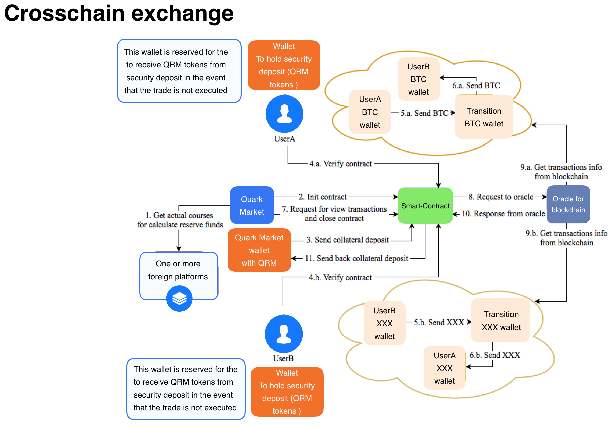

# Quark Market
## About
The first decentralised cross chain trading platform based on dark pool technology. 

### Problems
 - Liquidity fragmentation

*More than 200 exchanges operating independently of each other result in fragmented liquidity*

 - Market impact of big orders

*Booked orders on exchanges are visible for all, which means that large orders (even before execution) have a market impact. It is this reason, to avoid market impact of booked orders, that large players feel the need to trade on OTC market. Even though huge trading volumes on the OTC market, there is no single marketplace*

 - Centralization

*An overwhelming majority of crypto exchanges are centralized. The result is high fees and an unacceptable risk to the tradersÕ funds from hackers. Herewith, the fees are several times higher compared to the classical markets. Traders frequently get charged three times: deposit and withdrawal of funds, as well as on the trade itself*

### Solution

 - Dark Pool technology

 *It allows traders to submit buy/sell orders without showing the volume, price or direction of the order.  The system then matches buyers and sellers with compatible trade specifications. The fact that prices and volume of orders are (placed in Òdark poolsÓ) kept silent eliminates the potential of market impact.*
 
 - Cross chain swaps

*It allows to trade via smart contracts crypto currencies and tokens which are based on different blockchains. The ability to trade assets from different blockchains on a decentralized basis, makes it possible to gather the whole market on one marketplace!*

 - Directly p2p transactions

*Matching engine will be off-chain, but all the transactions will be settled on-chain. This allows fast and low-cost trading combined with directly, secure and transparent transactions.*

## Processes
UserA wants to send BTC and get XXX cryptocurrency.
UserB wants to send XXX and get BTC.

1.  UserA and UserB create requests in Quark Market. 
2. UserA and UserB pay commission and warranty obligations.    
3.  Quark market matches requests of UserA and UserB as similar.

*Picture 1. Orders. Creating and matching.*

4. Decentralised cross chain trading.

*Picture 2. cross chain exchange algorithm.*

## Current version of product

### 1. Create Order
Users enter their wallets, changing currencies and amounts.

 ### 2. Send reserve funds
Quark Market platform sends tokens into smart-contract as a guarantee of exchange.
Count of tokens calculates from the amount of order.
   
From this moment exchange is decentralised.  
Nobody can take tokens from the smart-contract.

### 3. Matching
Quark platform makes matching of all not matched requests.
After this step system has matched exchange objects. 

Each exchange is a pair of two matched orders.

### 4. Close contract
Smart-contract gets information about transactions in other blockchains from the oracle.

**Positive case.**
If all transactions are complited, then smart-contract will send reserved funds back to Quark Market.

**Negative case.**
For example, Quark Market does not work the right way.  
Quark market got money from users but did not make transactions from transit wallets for users during expiration time.

Smart-contract will send reserved from Quark Market funds to the Users.